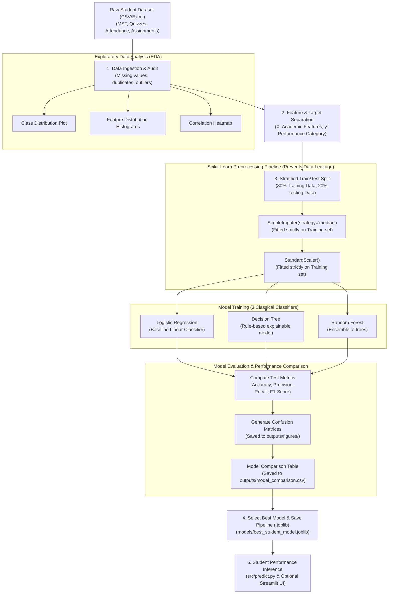

# Assignment Flowchart & Methodology Documentation

This document fulfills the mandatory assignment requirement:
> *"A flow diagram/documentation clearly showing preprocessing and visualization steps."*

---

## 1. End-to-End Machine Learning Process Flow

---

## 2. Explanation of Flowchart Stages

### Stage 1: Data Ingestion & Cleaning
- **Objective**: Ensure the incoming dataset is free of formatting issues, duplicate entries, and impossible numbers.
- **Actions**:
  - Load raw data via `pandas`.
  - Count and inspect missing values (`isnull().sum()`).
  - Drop duplicate student rows.

### Stage 2: Exploratory Data Analysis (EDA)
- **Objective**: Understand patterns in the data before training any model.
- **Actions**:
  - Bar plot of student counts per performance tier.
  - Distribution histograms for MST scores, Quizzes, Attendance, and Assignments.
  - Correlation heatmap to check which features correlate strongest with academic success.

### Stage 3: Train/Test Split (Stratified)
- **Objective**: Create an unbiased testing partition to measure generalization performance.
- **Methodology**: An 80/20 train/test split with stratification (`stratify=y`) ensures the proportion of High, Average, and Needs Improvement students remains identical in both sets.

### Stage 4: Preprocessing Pipeline (Leakage-Free Normalization)
- **Objective**: Standardize feature ranges and impute any missing entries without leaking test set statistics into training.
- **Methodology**: `SimpleImputer` and `StandardScaler` are wrapped inside a Scikit-Learn `Pipeline`. Parameters ($\mu, \sigma$) are computed **only** on `X_train`.

### Stage 5: Classification Algorithms
- **Logistic Regression**: Linear multiclass baseline.
- **Decision Tree**: Generates transparent, readable decision rules.
- **Random Forest**: Aggregates predictions of multiple decorrelated decision trees to improve stability.

### Stage 6: Evaluation & Selection
- **Metrics**: Accuracy, Precision (Macro/Weighted), Recall (Macro/Weighted), F1-Score (Macro/Weighted), and Confusion Matrix.
- **Selection**: The model with the best Macro F1-score on the test set is saved as `models/best_student_model.joblib`.
