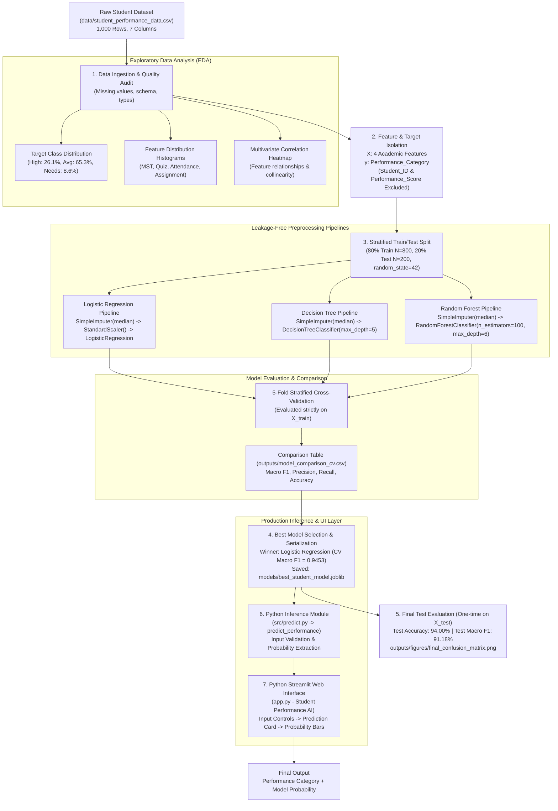

# Final Project Architecture & Methodology Specification

**Project Title**: Student Performance Classification using Classical Machine Learning  
**Lead & Core ML**: Raghav  
**Documentation & Viva**: Divyanshi  
**UI Integration**: Aabiya  

---

## 1. End-to-End System Architecture

---

## 2. Component Specifications

### 2.1 Data Layer
- **Source**: `data/student_performance_data.csv` (1,000 observations).
- **Features ($X$)**:
  1. `MST_Score` ($0 - 100$): Mid-Semester Test examination score.
  2. `Quiz_Score` ($0 - 100$): Continuous assessment quiz score.
  3. `Attendance_Percent` ($0 - 100\%$): Classroom lecture attendance percentage.
  4. `Assignment_Score` ($0 - 100$): Homework and assignment mark.
- **Target ($y$)**: `Performance_Category` (Multi-class: *High Performer*, *Average Performer*, *Needs Improvement*).
- **Explicit Exclusions**:
  - `Student_ID`: Unique key (`STU0001` to `STU1000`), excluded to prevent identifier memorization.
  - `Performance_Score`: Deterministic linear combination of inputs ($0.4\times\text{MST} + 0.2\times\text{Quiz} + 0.2\times\text{Att} + 0.2\times\text{Assign}$), excluded to prevent target leakage.

### 2.2 Preprocessing & Partitioning Layer
- **Split Ratio**: 80% Training ($N=800$), 20% Testing ($N=200$).
- **Stratification**: `stratify=y` guarantees exact class balance across partitions.
- **Imputation**: `SimpleImputer(strategy='median')` fitted strictly on training data.
- **Scaling**: `StandardScaler()` applied to Logistic Regression (linear distance-sensitive algorithm). Tree models skip scaling as split points are scale-invariant.

### 2.3 Model Training & Cross-Validation Layer
- **Class Imbalance Management**: `class_weight='balanced'` configured for all models.
- **Validation**: 5-Fold Stratified Cross-Validation on the 80% training set.
- **Model Comparison Results (CV on Training Data)**:
  - **Logistic Regression**: CV Accuracy = $0.9612 \pm 0.0145$, CV Macro F1 = $\mathbf{0.9453 \pm 0.0257}$ (Selected Best Model).
  - **Decision Tree**: CV Accuracy = $0.8625 \pm 0.0198$, CV Macro F1 = $0.8293 \pm 0.0187$.
  - **Random Forest**: CV Accuracy = $0.9175 \pm 0.0160$, CV Macro F1 = $0.8939 \pm 0.0314$.

### 2.4 Final Evaluation Layer (Held-out Test Set)
- **Sample Size**: 200 unseen samples.
- **Logistic Regression Test Results**:
  - Test Accuracy: $\mathbf{94.00\%}$
  - Test Macro Precision: $87.35\%$
  - Test Macro Recall: $96.95\%$
  - Test Macro F1-Score: $\mathbf{91.18\%}$
  - Test Weighted F1-Score: $94.21\%$
  - Minority Class ("Needs Improvement") Recall: $\mathbf{100.0\%}$ (Zero false negatives).

### 2.5 Inference & Presentation Layer
- **Model Serialization**: `models/best_student_model.joblib` (Self-contained Scikit-learn Pipeline).
- **Backend Inference (`src/predict.py`)**:
  - Validates feature ranges ($0 \le \text{value} \le 100$).
  - Assembles single-row DataFrame with explicit feature headers.
  - Automatically executes pipeline preprocessing and estimator inference.
  - Dynamically extracts probability distribution via `pipeline.classes_`.
- **Frontend UI (`app.py`)**:
  - Pure Python Streamlit application with modern glassmorphic interface.
  - Directly consumes `src.predict.predict_performance`.
  - Zero training or data preprocessing logic embedded in the UI layer.
