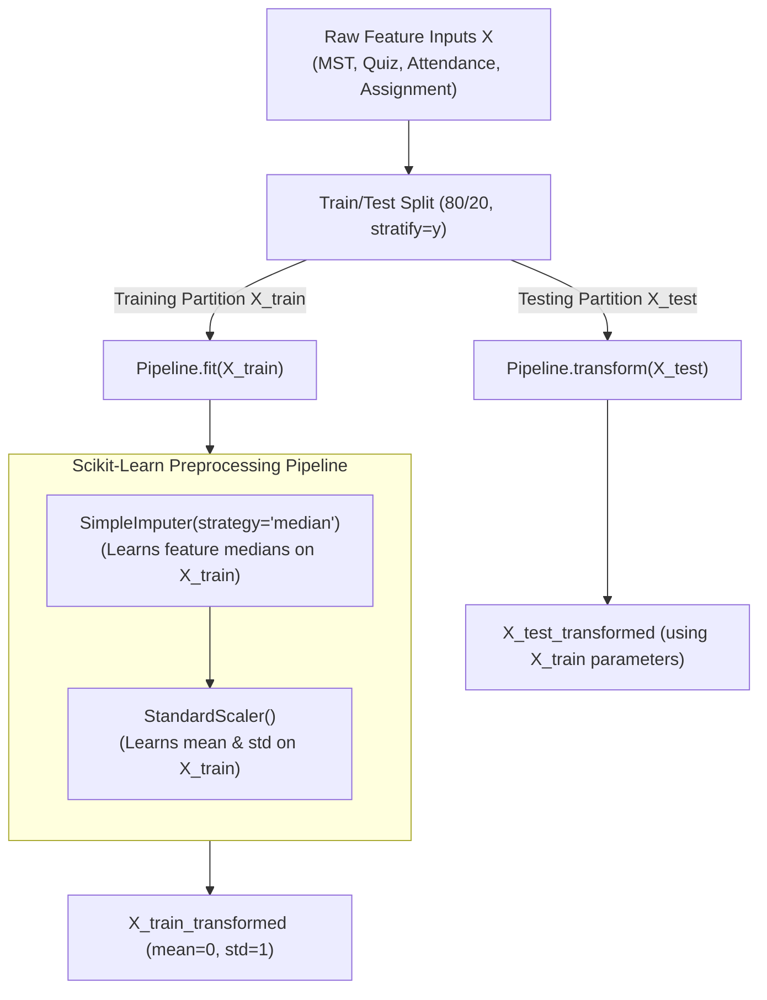

# Phase 2B — Data Preprocessing, EDA & Leakage-Free Pipeline Report

**Project**: Student Performance Classification using Classical Machine Learning  
**Phase**: Phase 2B — Data Preprocessing, EDA & Leakage-Free Pipeline Preparation  
**Date**: August 28, 2026  
**Author**: Raghav (Core ML Lead)  
**Dataset**: `data/student_performance_data.csv` (1,000 records, 7 columns)  

---

## 1. Feature & Target Selection

Based on the verified schema and academic project goals, the machine learning dataset partition is defined as:

### Feature Matrix ($X$)
Composed strictly of four raw academic indicators:
1. `MST_Score`: Mid-Semester Test examination score ($0 - 100$).
2. `Quiz_Score`: Continuous quiz evaluation results ($0 - 100$).
3. `Attendance_Percent`: Student classroom attendance percentage ($0 - 100\%$).
4. `Assignment_Score`: Practical homework and assignment performance ($0 - 100$).

### Target Vector ($y$)
- `Performance_Category`: Multi-class categorical tier with 3 discrete levels:
  - `High Performer`
  - `Average Performer`
  - `Needs Improvement`

---

## 2. Excluded Columns & Academic Justification

| Excluded Column | Column Type | Reason for Exclusion | Academic ML Justification |
| :--- | :---: | :---| :---|
| `Student_ID` | Identifier | Arbitrary identifier key (`STU0001` to `STU1000`) | Non-generalizable token. Including identifiers leads to meaningless memorization without predictive validity. |
| `Performance_Score` | Continuous Composite Score | **Target Leakage** | Mathematical analysis confirmed that `Performance_Score` is a deterministic weighted linear sum ($0.40\times\text{MST} + 0.20\times\text{Quiz} + 0.20\times\text{Att} + 0.20\times\text{Assign}$) whose thresholds directly define `Performance_Category`. Including it would give the model artificial 100% access to the target label. |

---

## 3. Train / Test Split Methodology

The feature matrix $X$ and target vector $y$ are partitioned as follows:
- **Split Ratio**: 80% Training Data ($N = 800$), 20% Testing Data ($N = 200$).
- **Stratification**: `stratify=y` ensures exact class representation across both partitions.
- **Reproducibility**: `random_state=42`.

### Partition Breakdown
| Class Label | Full Dataset ($N=1000$) | Train Partition ($N=800$) | Test Partition ($N=200$) |
| :--- | :---: | :---: | :---: |
| **Average Performer** | 653 (65.30%) | 522 (65.25%) | 131 (65.50%) |
| **High Performer** | 261 (26.10%) | 209 (26.12%) | 52 (26.00%) |
| **Needs Improvement** | 86 (8.60%) | 69 (8.62%) | 17 (8.50%) |

---

## 4. Missing-Value Handling Strategy

### Empirical Finding
- 24 total missing entries (0.6% across `MST_Score`, `Quiz_Score`, `Attendance_Percent`, and `Assignment_Score`).

### Preprocessing Design
- **Transformer**: `SimpleImputer(strategy='median')`.
- **Academic Justification**:
  1. **Median vs. Mean**: The median is robust to extreme values and preserves the typical central score without skewing due to outliers.
  2. **Leakage Prevention**: Imputer medians are computed **strictly from the training partition** ($X_{train}$) during pipeline fitting.
  3. **Learned Training Medians**:
     - `MST_Score`: $64.10$
     - `Quiz_Score`: $63.80$
     - `Attendance_Percent`: $79.20$
     - `Assignment_Score`: $66.10$
  4. Test instances ($X_{test}$) are transformed using these learned training medians without recalculating statistics on the test set.

---

## 5. Feature Scaling Strategy

### Preprocessing Design
- **Transformer**: `StandardScaler()` (Z-score normalization: $z = \frac{x - \mu}{\sigma}$).
- **Academic Justification**:
  1. **Multinomial Logistic Regression**: Requires scaled features because gradient-descent optimization and regularization penalties ($\ell_1, \ell_2$) assume commensurate feature magnitudes.
  2. **Tree-Based Models (Decision Trees, Random Forests)**: In principle, tree classifiers do not require feature scaling because split points are determined by monotonic feature ordering. However, chaining standard scaling inside a pipeline ensures a uniform interface without impacting tree performance.
  3. **Leakage Prevention**: Scaler parameters ($\mu, \sigma$) are computed **only on $X_{train}$**:
     - `MST_Score`: $\mu = 64.7045, \sigma = 15.8125$
     - `Quiz_Score`: $\mu = 63.7479, \sigma = 16.0155$
     - `Attendance_Percent`: $\mu = 75.4130, \sigma = 17.6410$
     - `Assignment_Score`: $\mu = 65.8716, \sigma = 15.0255$

---

## 6. Preprocessing Pipeline Architecture

---

## 7. Exploratory Data Analysis (EDA) Findings

### 7.1 Descriptive Numerical Summary
| Feature | Count | Mean | Std Dev | Min | 25% (Q1) | Median | 75% (Q3) | Max | Missing |
| :---|:---:|:---:|:---:|:---:|:---:|:---:|:---:|:---:|:---:|
| `MST_Score` | 994 | 64.7767 | 16.1657 | 10.00 | 54.000 | 64.35 | 75.400 | 100.00 | 6 (0.6%) |
| `Quiz_Score` | 994 | 63.8288 | 15.9938 | 0.00 | 53.600 | 63.50 | 74.900 | 100.00 | 6 (0.6%) |
| `Attendance_Percent` | 994 | 75.0655 | 17.7200 | 20.10 | 66.800 | 79.10 | 88.600 | 99.90 | 6 (0.6%) |
| `Assignment_Score` | 994 | 66.0030 | 15.2253 | 4.10 | 56.000 | 66.30 | 76.500 | 100.00 | 6 (0.6%) |

### 7.2 Feature Correlation Analysis (ML Features Only)
| Pearson Correlation ($r$) | MST_Score | Quiz_Score | Attendance_Percent | Assignment_Score |
| :--- | :---:| :---:| :---:| :---:|
| **MST_Score** | 1.0000 | 0.6567 | 0.1035 | 0.6349 |
| **Quiz_Score** | 0.6567 | 1.0000 | 0.0855 | 0.5686 |
| **Attendance_Percent** | 0.1035 | 0.0855 | 1.0000 | 0.1250 |
| **Assignment_Score** | 0.6349 | 0.5686 | 0.1250 | 1.0000 |

- **Observation**: Examination scores (`MST_Score`, `Quiz_Score`, `Assignment_Score`) exhibit moderate-to-strong positive correlation ($r \approx 0.57 - 0.66$), demonstrating consistent student academic performance across testing formats.
- **Attendance**: Has low linear correlation with individual test scores ($r \approx 0.09 - 0.13$), indicating that attendance provides an independent behavioral signal not redundant with exam performance.

---

## 8. Outlier & Range Inspection

Using the standard Interquartile Range ($1.5 \times \text{IQR}$) rule:
- `MST_Score`: Bounds $[22.71, 107.01]$ $\rightarrow$ 4 points $< 22.71$ (Min = $10.0$).
- `Quiz_Score`: Bounds $[22.36, 105.46]$ $\rightarrow$ 4 points $< 22.36$ (Min = $0.0$).
- `Attendance_Percent`: Bounds $[36.04, 119.94]$ $\rightarrow$ 50 points $< 36.04$ (Min = $20.1\%$).
- `Assignment_Score`: Bounds $[23.56, 108.26]$ $\rightarrow$ 4 points $< 23.56$ (Min = $4.1$).

### Outlier Handling Decision
- **Observation**: Low score and low attendance instances belong genuinely to struggling students (primarily in the `Needs Improvement` category).
- **Decision**: **Do NOT delete or clip outliers**. These values represent legitimate real-world academic distress. Removing them would artificially strip away the critical signals needed to identify at-risk students.

---

## 9. Class Imbalance Documentation

- **Observed Proportions**:
  - `Average Performer`: 65.30% (Majority)
  - `High Performer`: 26.10% (Moderate)
  - `Needs Improvement`: 8.60% (Minority)
- **Imbalance Ratio**: $7.59 : 1$.
- **Strategy for Phase 3**:
  - **No Synthetic Resampling in Preprocessing**: SMOTE or undersampling is not applied to avoid distorting natural academic distributions.
  - **Algorithm-Level Weighting**: Use `class_weight='balanced'` in Logistic Regression, Decision Trees, and Random Forests.
  - **Evaluation Focus**: Primary model ranking based on **Macro F1-Score** and **Macro Recall**.

---

## 10. Generated Visualizations

All 8 figures have been generated and saved to `outputs/figures/`:
1. [`performance_category_distribution.png`](file:///e:/Classic%20ML%20project/outputs/figures/performance_category_distribution.png): Target class counts and percentages.
2. [`mst_score_distribution.png`](file:///e:/Classic%20ML%20project/outputs/figures/mst_score_distribution.png): Mid-semester test score histogram with mean/median markers.
3. [`quiz_score_distribution.png`](file:///e:/Classic%20ML%20project/outputs/figures/quiz_score_distribution.png): Quiz score histogram and density curve.
4. [`attendance_distribution.png`](file:///e:/Classic%20ML%20project/outputs/figures/attendance_distribution.png): Attendance percentage distribution.
5. [`assignment_score_distribution.png`](file:///e:/Classic%20ML%20project/outputs/figures/assignment_score_distribution.png): Assignment score histogram and density curve.
6. [`feature_vs_performance_category.png`](file:///e:/Classic%20ML%20project/outputs/figures/feature_vs_performance_category.png): Bivariate boxplots of all 4 features across the 3 categories.
7. [`feature_correlation_heatmap.png`](file:///e:/Classic%20ML%20project/outputs/figures/feature_correlation_heatmap.png): Correlation heatmap of the 4 ML features.
8. [`outlier_inspection_boxplots.png`](file:///e:/Classic%20ML%20project/outputs/figures/outlier_inspection_boxplots.png): Comparative boxplots for outlier analysis.

---

## 11. Observed Facts vs. Recommendations

### Observed Facts (Empirical)
1. $X$ comprises 4 continuous numerical features; $y$ comprises 3 target classes.
2. `Performance_Score` is a direct mathematical precursor to `Performance_Category` and would cause 100% data leakage if included in $X$.
3. 24 feature values are missing across the 1,000 records (0.6% per feature).
4. Class proportions are 65.3% Average, 26.1% High, and 8.6% Needs Improvement.
5. All scores and percentages reside strictly within the physical range $[0, 100]$.

### Recommendations (For Phase 3 Model Training)
1. Connect classifiers (Logistic Regression, Decision Tree, Random Forest) directly to the prepared preprocessing pipeline.
2. Use 5-Fold Stratified Cross-Validation on the training partition ($N=800$) to tune hyperparameters.
3. Evaluate models on the unseen test partition ($N=200$) using Macro Precision, Macro Recall, Macro F1-Score, and Confusion Matrices.
4. Apply `class_weight='balanced'` to prevent bias toward the majority class.

---

## 12. Next Phase (Phase 3: Model Training & Evaluation)

Upon receiving user approval, Phase 3 will:
1. Implement and train:
   - Baseline: Multinomial Logistic Regression (`multi_class='multinomial'`).
   - Rule-Based: Decision Tree Classifier (`criterion='gini'`).
   - Ensemble: Random Forest Classifier (`n_estimators=100`).
2. Perform hyperparameter tuning via GridSearchCV.
3. Compute evaluation metrics (Accuracy, Macro Precision, Macro Recall, Macro F1-score).
4. Generate comparative metric tables and confusion matrices.
