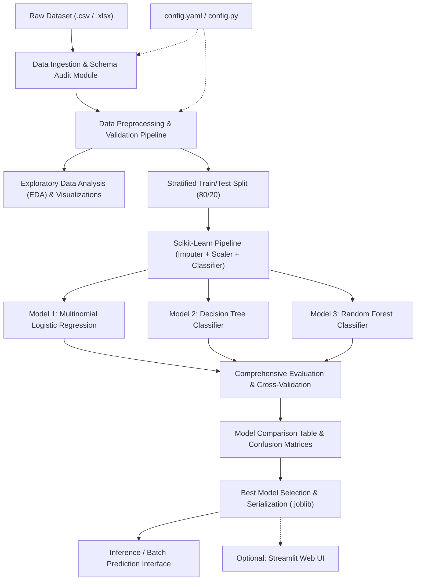

# Implementation Plan: Student Performance Classification using Classical ML

## Project Overview
This project develops an explainable, academic Classical Machine Learning classification system to categorize students into three distinct performance tiers:
1. **High Performer**
2. **Average Performer**
3. **Needs Improvement**

The system is designed to be **dataset-agnostic** until the actual dataset (expected to contain MST scores, quiz results, attendance, assignment scores, etc.) is integrated. It adheres strictly to academic ML best practices: scikit-learn pipelines to eliminate data leakage, modular/clean code for student readability, comprehensive multi-metric evaluations, config-driven schema mapping, and clear documentation.

---

## User Review Required

> [!IMPORTANT]
> **No Synthetic/Fabricated Data Rule**: Per project requirements, no datasets, columns, target generation rules, or fake performance numbers have been fabricated. All code modules will use configuration files (`config.yaml` or `config.py`) to map real column names and target definitions once the dataset is provided.

> [!NOTE]
> **Core vs. Optional Scope Separation**:
> - **Core Assignment Scope**: Data preprocessing, missing value handling, normalization, training/evaluating classical classifiers (Logistic Regression, Decision Tree, Random Forest), metrics calculation, confusion matrix, and process flowcharts.
> - **Optional Enhancement**: Lightweight Streamlit web application for interactive inference/demonstration (kept strictly decoupled from core ML library).

---

## Detailed Architectural & Implementation Strategy (A–Q)

### A. Project Architecture
The architecture is structured as a **Config-Driven Modular Pipeline**:



---

### B. Recommended Folder & File Structure

```text
e:/Classic ML project/
│
├── config/
│   └── config.yaml                 # Schema mappings, hyperparameter grids, file paths
│
├── data/
│   ├── raw/                        # Storage for incoming raw dataset (untouched)
│   └── processed/                  # Cached processed datasets for fast inspection
│
├── docs/
│   ├── flowcharts/                 # Preprocessing & ML workflow diagrams
│   └── presentation_outline.md     # PPT presentation draft structure
│
├── notebooks/                      # Exploratory & student demonstration notebooks
│   ├── 01_eda_and_audit.ipynb      # EDA, statistical summaries & visual analysis
│   └── 02_model_experimentation.ipynb # Step-by-step model training walkthrough
│
├── models/
│   └── saved_models/               # Serialized final pipeline (.joblib) & metadata
│
├── reports/
│   ├── figures/                    # Saved plots (confusion matrices, ROC/PR curves, feature importance)
│   └── metrics_summary.csv         # Comparative metrics table
│
├── src/                            # Core Python ML package
│   ├── __init__.py
│   ├── data/
│   │   ├── __init__.py
│   │   ├── loader.py               # Robust CSV/Excel loader & schema validation
│   │   └── auditor.py              # Data quality audit (missing, outliers, types)
│   │
│   ├── features/
│   │   ├── __init__.py
│   │   └── preprocessor.py         # Sklearn-compatible transformers & pipeline builder
│   │
│   ├── models/
│   │   ├── __init__.py
│   │   ├── train.py                # Model training, hyperparameter tuning & cross-validation
│   │   ├── evaluate.py             # Evaluation metrics (Accuracy, Macro/Weighted F1, Recall, Precision)
│   │   └── compare.py              # Comparison logic & best model selector
│   │
│   └── utils/
│       ├── __init__.py
│       ├── visualizer.py           # Matplotlib/Seaborn plotting functions
│       └── logger.py               # Standardized console/file logger
│
├── tests/                          # Unit & integration tests
│   ├── test_data_loader.py
│   ├── test_preprocessor.py
│   └── test_model_pipeline.py
│
├── app.py                          # Optional lightweight Streamlit web demo
├── requirements.txt                # Python package dependencies
├── README.md                       # Comprehensive project guide for students/evaluators
└── .gitignore                      # Git exclusion rules (__pycache__, raw data, venv)
```

---

### C. Python Environment & Dependencies
Standardized classical ML stack targeting **Python 3.10+**:

- **Data Manipulation**: `pandas>=2.0.0`, `numpy>=1.24.0`
- **Machine Learning**: `scikit-learn>=1.3.0`
- **Visualization**: `matplotlib>=3.7.0`, `seaborn>=0.12.0`
- **Configuration & Utilities**: `pyyaml>=6.0`, `joblib>=1.3.0`
- **Optional Web App**: `streamlit>=1.28.0`
- **Testing & Code Quality**: `pytest>=7.4.0`

---

### D. Dataset Integration Strategy
When the real dataset arrives:
1. Place raw file into `data/raw/student_data.csv` (or `.xlsx`).
2. Update `config/config.yaml` to define:
   - File path and format.
   - Numerical feature column names (e.g., MST, Quizzes, Attendance, Assignments).
   - Categorical feature column names (e.g., Department, Gender, if present).
   - Target column name (or target-rule thresholds if raw percentage/scores must be categorized into 3 classes).
   - Class label mapping: `0: Needs Improvement`, `1: Average Performer`, `2: High Performer`.

---

### E. Dataset Validation & Audit Strategy
Before running preprocessing or modeling, the automated `auditor.py` executes:
- **Shape & Column Check**: Confirms expected columns against `config.yaml`.
- **Data Types Check**: Ensures numerical scores are parsed as numeric (`float64`/`int64`).
- **Null / Missing Value Audit**: Identifies exact counts and percentages of missing entries per feature.
- **Duplicate Records Check**: Flags and reports duplicate rows.
- **Value Range & Sanity Check**: Identifies domain violations (e.g., negative scores, marks > max marks, attendance > 100%).
- **Class Balance Check**: Evaluates distribution of the target class to detect class imbalance.

---

### F. Preprocessing Strategy & Data Leakage Prevention

1. **Handling Missing Values**:
   - Numerical features: Median or Mean Imputation (`SimpleImputer(strategy='median')`).
   - Categorical features: Most frequent or constant imputation (`SimpleImputer(strategy='most_frequent')`).
2. **Handling Duplicates & Invalid Values**:
   - Remove strict duplicate rows during data loading.
   - Clip or filter values exceeding valid boundary ranges.
3. **Normalization & Scaling**:
   - `StandardScaler` (Z-score normalization: $\mu=0, \sigma=1$) or `MinMaxScaler` ($[0, 1]$ range).
   - One-Hot Encoding (`OneHotEncoder(handle_unknown='ignore')`) for categorical variables.
4. **Data Leakage Prevention**:
   - **Crucial Rule**: The dataset is split into `X_train, X_test, y_train, y_test` **BEFORE** applying any scaling or imputation.
   - Preprocessing steps and model classifiers are encapsulated into a unified `sklearn.pipeline.Pipeline` or `ColumnTransformer`.
   - `pipeline.fit(X_train, y_train)` computes statistics strictly from the training partition; `pipeline.predict(X_test)` applies them cleanly.

---

### G. EDA & Visualization Strategy
Dataset-driven visual explorations generated once data is loaded:
- **Univariate Analysis**: Histograms & KDE density curves for score distributions; bar charts for attendance and category distributions.
- **Bivariate / Multivariate Analysis**:
  - Boxplots & Violin plots showing feature distribution across the 3 student performance classes.
  - Correlation Heatmap (Pearson/Spearman) to analyze collinearity between MST, Quizzes, and Final performance.
  - Pairwise scatter plots for key academic indicators.
- **Exporting**: All plots automatically saved with high DPI in `reports/figures/`.

---

### H. Train/Test Methodology
- **Split Ratio**: 80% Training, 20% Testing (configurable in `config.yaml`).
- **Stratification**: `StratifiedShuffleSplit` / `train_test_split(..., stratify=y)` ensures identical class proportions in both train and test splits, preventing class skew.
- **Validation**: 5-Fold Stratified Cross-Validation on the training set to evaluate stability before test-set evaluation.

---

### I. Classification Model Strategy
Three distinct classical ML algorithms suitable for 3-class academic performance classification:

1. **Multinomial Logistic Regression**:
   - *Role*: Linear baseline model with high interpretability and probabilistic outputs.
   - *Key Hyperparameters*: Regularization strength `C`, penalty (`l1`, `l2`), solver (`lbfgs`, `saga`).
2. **Decision Tree Classifier**:
   - *Role*: Non-linear, rule-based classifier providing transparent if-else decision paths that students/educators can directly read.
   - *Key Hyperparameters*: `max_depth`, `min_samples_split`, `min_samples_leaf`, `criterion` (`gini`/`entropy`).
3. **Random Forest Classifier**:
   - *Role*: Ensemble model combining multiple decision trees to reduce variance, prevent overfitting, and provide robust feature importance rankings.
   - *Key Hyperparameters*: `n_estimators`, `max_depth`, `max_features`, `min_samples_split`.

---

### J. Model Evaluation Strategy
Comprehensive multi-class evaluation metrics calculated on test set:
- **Accuracy**: Overall classification accuracy.
- **Precision (Macro & Weighted)**: Measure of false positive control across classes.
- **Recall (Macro & Weighted)**: Measure of false negative control (especially critical for identifying "Needs Improvement" students).
- **F1-Score (Macro & Weighted)**: Harmonic mean balancing precision and recall.
- **Confusion Matrix**: Normalized & count-based heatmaps showing exact misclassifications between High, Average, and Needs Improvement.
- **Classification Report**: Per-class precision, recall, and F1-score breakdown.

---

### K. Model Comparison Strategy
- Comparison table saved to `reports/metrics_summary.csv` and rendered cleanly in console/notebooks:
  - Columns: `Model Name`, `Train Accuracy`, `Test Accuracy`, `Macro Precision`, `Macro Recall`, `Macro F1-score`, `CV Mean F1`, `CV Std Dev`.
- Visual comparisons: Bar chart comparing Macro F1-scores and Accuracy across all three models.

---

### L. Final Model Selection & Saving Strategy
- **Selection Criteria**: Highest Cross-Validated Macro F1-score with minimal train-test gap (lowest overfitting).
- **Artifact Serialization**:
  - The complete winning `Pipeline` (including fitted scaler, imputer, and classifier) is saved to `models/saved_models/best_student_classifier.joblib`.
  - Accompanying `model_metadata.json` stores training timestamp, feature names, hyperparameter configuration, and test metrics.

---

### M. Prediction / Inference Workflow
- Dedicated script/function `predict_student_performance(input_data)`:
  - Accepts a Pandas DataFrame or dictionary of new student inputs.
  - Loads the serialized pipeline.
  - Performs end-to-end preprocessing, scaling, and classification.
  - Outputs predicted class name and class probability distribution.

---

### N. Optional Web Interface (Streamlit)
- Interactive student performance dashboard:
  - Input sliders/fields for MST score, Quiz results, Attendance percentage, Assignment scores.
  - Predict button triggering inference via the loaded `.joblib` pipeline.
  - Visual output showing predicted tier ("High Performer", "Average Performer", "Needs Improvement") with gauge/bar chart of prediction probabilities and feature contribution insights.

---

### O. Testing & Quality Assurance Strategy
- `pytest` suite testing:
  - Data loader handling missing files and corrupted formats.
  - Preprocessor preserving correct output matrix dimensions.
  - Pipeline fitting and predicting without throwing exceptions or encountering data leakage.
  - Config schema integrity checks.

---

### P. Documentation & Presentation Deliverables
- **Flow Diagrams**: Clear visual representation of data preprocessing and ML stages using Mermaid & exportable graphics.
- **README.md**: Clear step-by-step instructions for setup, running training, reproducing evaluation results, and launching the optional app.
- **Presentation Outline (`docs/presentation_outline.md`)**: Structured 10-slide outline for academic defense/submission.

---

### Q. Checkpoint & Version Control Strategy
- Git repository structure with a tailored `.gitignore`.
- Raw data and heavy binary artifacts tracked safely; clean commit progression separating scaffolding, data integration, pipeline building, model training, and reporting.

---

## Verification Plan

### Phase 1: Structure & Scaffolding Verification (Immediate upon approval)
- Create folder hierarchy (`config/`, `data/`, `docs/`, `notebooks/`, `models/`, `reports/`, `src/`, `tests/`).
- Create configuration file `config/config.yaml` with clear parameter placeholders.
- Create `requirements.txt` with exact version specifications.
- Create `README.md` and `docs/` templates.
- Verify environment setup and package import readiness using automated test skeletons.

### Phase 2: Full Dataset Processing & Training (When dataset is provided by user)
- Execute `auditor.py` on real dataset.
- Run complete training pipeline across Logistic Regression, Decision Tree, and Random Forest.
- Validate metrics, export confusion matrices, and generate comparative summary report without any synthetic data fabrication.
